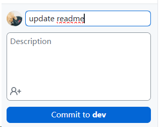
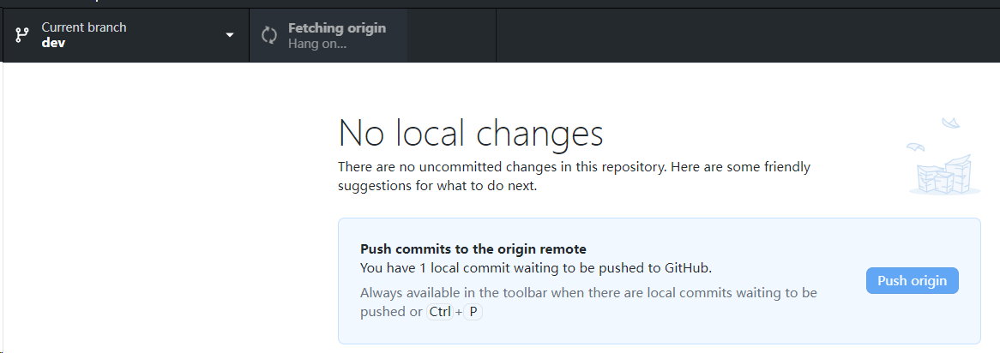

# Yunlv-Connect-the-Dorms

<!-- START doctoc generated TOC please keep comment here to allow auto update -->
<!-- DON'T EDIT THIS SECTION, INSTEAD RE-RUN doctoc TO UPDATE -->
**Table of Contents**

- [开发计划](#%E5%BC%80%E5%8F%91%E8%AE%A1%E5%88%92)
  - [如何在 Github Desktop 进行代码管理](#%E5%A6%82%E4%BD%95%E5%9C%A8-github-desktop-%E8%BF%9B%E8%A1%8C%E4%BB%A3%E7%A0%81%E7%AE%A1%E7%90%86)
    - [在本地克隆远程库](#%E5%9C%A8%E6%9C%AC%E5%9C%B0%E5%85%8B%E9%9A%86%E8%BF%9C%E7%A8%8B%E5%BA%93)
    - [从dev开发分支Fetch origin拉取远程仓库](#%E4%BB%8Edev%E5%BC%80%E5%8F%91%E5%88%86%E6%94%AFfetch-origin%E6%8B%89%E5%8F%96%E8%BF%9C%E7%A8%8B%E4%BB%93%E5%BA%93)
    - [Commit to `dev` 提交代码](#commit-to-dev-%E6%8F%90%E4%BA%A4%E4%BB%A3%E7%A0%81)
  - [手搓单元测试](#%E6%89%8B%E6%90%93%E5%8D%95%E5%85%83%E6%B5%8B%E8%AF%95)
    - [内置终端安装依赖](#%E5%86%85%E7%BD%AE%E7%BB%88%E7%AB%AF%E5%AE%89%E8%A3%85%E4%BE%9D%E8%B5%96)
    - [写测试文件](#%E5%86%99%E6%B5%8B%E8%AF%95%E6%96%87%E4%BB%B6)
  - [内置测试模块：工具-自动化测试](#%E5%86%85%E7%BD%AE%E6%B5%8B%E8%AF%95%E6%A8%A1%E5%9D%97%E5%B7%A5%E5%85%B7-%E8%87%AA%E5%8A%A8%E5%8C%96%E6%B5%8B%E8%AF%95)
- [其他](#%E5%85%B6%E4%BB%96)
  - [Git flow](#git-flow)
  - [Reference](#reference)

<!-- END doctoc generated TOC please keep comment here to allow auto update -->

## 开发计划

### 如何在 Github Desktop 进行代码管理

#### 在本地克隆远程库

#### 从dev开发分支Fetch origin拉取远程仓库

#### Commit to `dev` 提交代码

### 手搓单元测试

#### 内置终端安装依赖

`jest` 和 `miniprogram-simulate`

#### 写测试文件

新建 `xx.test.js`

导出函数 `module.exports` 测试和才能在其他文件中测试

`require` 引入文件

`describe` 和 `it` 测试用例

`package.json` 中添加 `scripts`

### 内置测试模块：工具-自动化测试

## 其他

### Git flow

### Reference

1. [利用GitHub Actions自动为README添加TOC目录](https://wiki.eryajf.net/pages/226388/)
2. [在小程序Web开发工具中使用Git做版本管理](https://help.gitee.com/enterprise/miniapp/在小程序Web开发工具中使用Git做版本管理)

