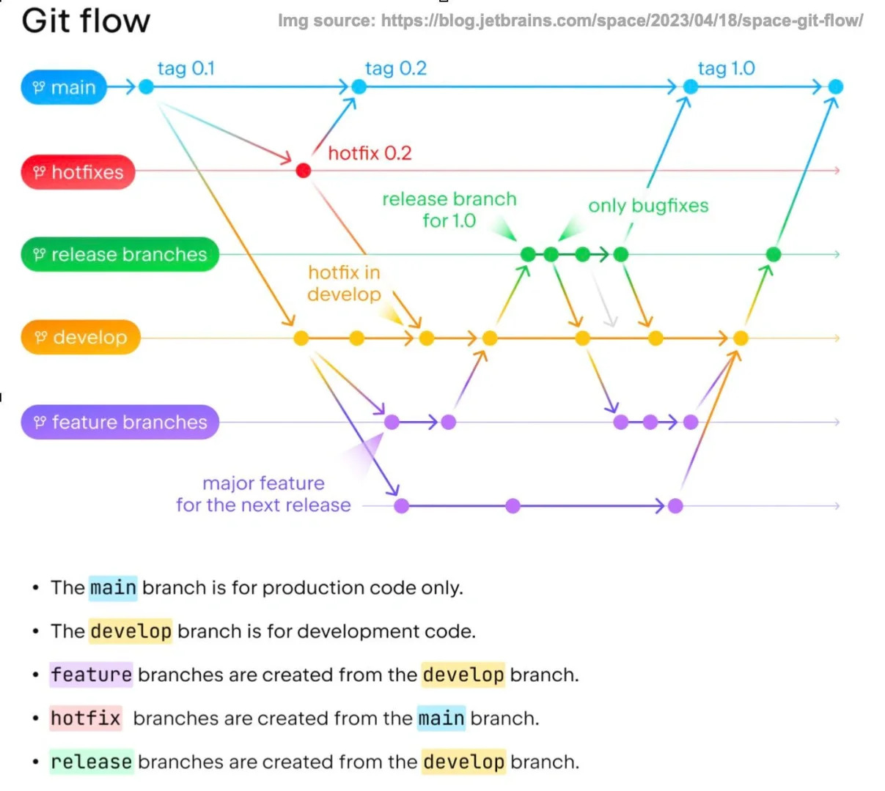
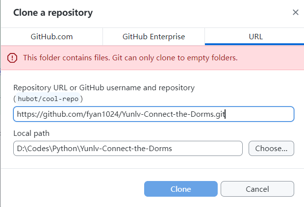
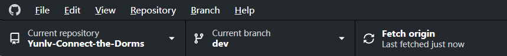

# Yunlv-Connect-the-Dorms

<!-- START doctoc generated TOC please keep comment here to allow auto update -->
<!-- DON'T EDIT THIS SECTION, INSTEAD RE-RUN doctoc TO UPDATE -->
**Table of Contents**

- [如何更新仓库](#%E5%A6%82%E4%BD%95%E6%9B%B4%E6%96%B0%E4%BB%93%E5%BA%93)
  - [在本地克隆远程库](#%E5%9C%A8%E6%9C%AC%E5%9C%B0%E5%85%8B%E9%9A%86%E8%BF%9C%E7%A8%8B%E5%BA%93)
  - [从dev开发分支Fetch origin拉取远程仓库](#%E4%BB%8Edev%E5%BC%80%E5%8F%91%E5%88%86%E6%94%AFfetch-origin%E6%8B%89%E5%8F%96%E8%BF%9C%E7%A8%8B%E4%BB%93%E5%BA%93)

<!-- END doctoc generated TOC please keep comment here to allow auto update -->

## 其他

### Git flow

### 如何在 Github Desktop 进行代码管理

#### 在本地克隆远程库

#### 从dev开发分支Fetch origin拉取远程仓库

### Reference

1. [利用GitHub Actions自动为README添加TOC目录](https://wiki.eryajf.net/pages/226388/)
2. 2 

